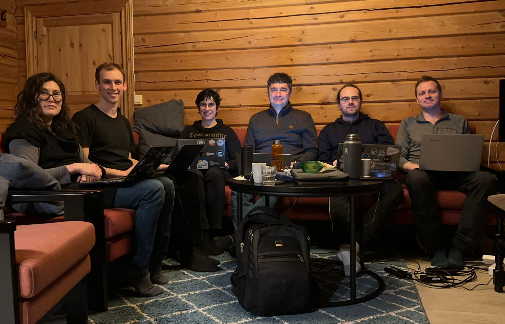
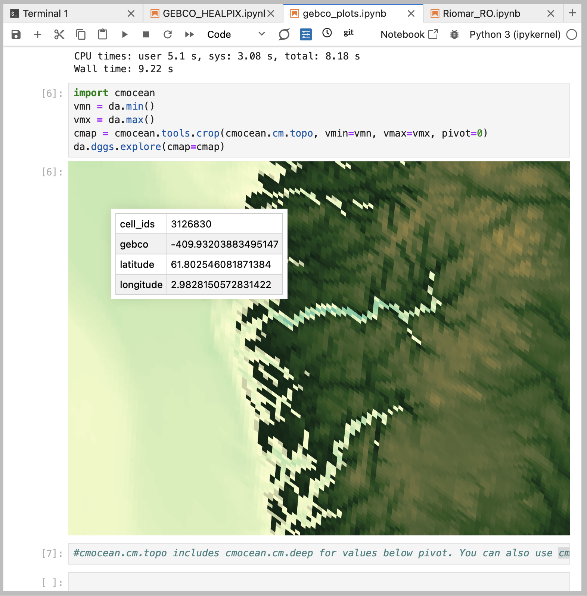

+++
title = "Read More in Our Blog"
slug = "blog"
sort_by = "weight"
weight = 3
+++

## Launching FAIR2Adapt Case Studies: Highlights from Hack4RiOMar

### Event Overview 📑
The Hack4RiOMar workathon brought together six motivated participants in person, collaborating to advance the FAIR2Adapt RiOMar Case Study—the first workshop in our series of FAIR2Adapt case studies. We extend our gratitude 👏  to the external experts who participated at their own expense, bringing their expertise to tackle challenges and drive progress.

**Participants** 🙋🙋:

| Name                   | Organization                            | GitHub Username |
|------------------------|----------------------------------------|-----------------|
| Even Moa Myklebust     | Simula Research Laboratory (Norway)   | @evenmm         |
| Jean-Marc Delouis      | IFREMER (France)                      | @jmdelouis      |
| Justus Magin           | CNRS-LOPS (France)                    | @keewis         |
| Ola Formo Kihle        | Independent Consultant / UW Contractor| @ofk123         |
| Tina Odaka             | IFREMER (France)                      | @tinaok         |
| Anne Fouilloux         | Simula Research Laboratory (Norway)   | @annefou        |

In the picture below, you can see the Hack4RiOMar team, listed from left to right: Tina, Even, Anne, Jean-Marc, Justus, and Ola.

### Key Achievements 🏆

#### Aggregating Virtual Datasets
We successfully aggregated virtual datasets into a single dataset using VirtualiZarr with kerchunk. Despite challenges with icechunk, alternative approaches enabled us to:
- Write Virtual Zarr locally and upload to accessible locations (e.g., Pangeo-EOSC S3, Datarmor IFREMER HC cluster).
- Develop a [Jupyter notebook showcasing this workflow](https://fair2adapt.github.io/Hack4RiOMAR/notebooks/virtualizarr_riomar_kerchunk.html).

#### Transforming Data into DGGS Grids
- A sample RiOMar dataset was transformed into a DGGS (Healpix) grid at various resolutions. Check the corresponding Jupyter Notebook [here](https://fair2adapt.github.io/Hack4RiOMAR/notebooks/pangeo-riomar.html). In the figure below, you can see the DGGS-transformed RiOMar data (temperature in degrees Celsius).

- To validate the robustness of the procedure, other datasets were transformed to DGGS: 
     - [Jupyter notebook to transform GEBCO Bathymetry data into DGGS (Healpix)](https://fair2adapt.github.io/Hack4RiOMAR/notebooks/GEBCO_HEALPIX.html)
       The figure below shows the GEBCO Bathymetry data transformed into DGGS:
       
     - [Jupyter notebook to transform Argo Kinetic Energy to DGGS (Healpix)](https://fair2adapt.github.io/Hack4RiOMAR/notebooks/pangeo-argo-KE-regridding.html)
- Visualizing transformed data with [xdggs](http://xdggs.readthedocs.io/en/latest/) (based on [lonboard](https://developmentseed.org/lonboard/latest/)).

#### Creating Conda Environments
To standardize workflows across platforms, we initiated Conda environments on Datarmor with:
- Support for Cubed and Dask libraries.
- Compatibility testing across platforms.

#### Testing Multi-Resolution Zarr Formats
Multiscale Zarr storage was tested for DGGS-transformed datasets, allowing us to:
- Explore hierarchical representations of RiOMar (see corresponding [Jupyter Notebook](https://fair2adapt.github.io/Hack4RiOMAR/notebooks/riomar_plots-datatree_multiresoplot.html)).
- Identify the potential for improved data accessibility and interoperability.

#### RO-Crate for FAIR Metadata
A sample dataset was encapsulated into a RO-Crate, helping:
- Assess the existing metadata for FAIR compliance.
- Identify missing elements, such as unique creator identifiers and data provenance.
- Check the corresponding Jupyter Notebook [here](https://fair2adapt.github.io/Hack4RiOMAR/notebooks/Riomar_RO.html)

### Challenges & Insights 🧩

**Icechunk Usability:** Limited documentation hindered progress, but kerchunk provided a robust alternative for creating virtual datasets.

**Interpolation Methods:** Conservative interpolation is needed for future case studies (e.g., radionuclide distribution in Arctic scenarios) to ensure mass conservation during regridding.

**Metadata Gaps:** Significant metadata enhancements are required for RiOMar datasets to meet FAIR standards.

### Jupyter Notebooks 📘

We developed [**20** Jupyter notebooks](https://github.com/FAIR2Adapt/Hack4RiOMAR/tree/main/notebooks) during the event!

### Where to Find Our Work 🔍
- **GitHub Repository:** [Hack4RiOMar Notebooks](https://github.com/FAIR2Adapt/Hack4RiOMAR/tree/main/notebooks)
- **[Rendered Notebooks with Highlights](https://fair2adapt.github.io/Hack4RiOMAR/notebooks/index.html):** A Jupyter Book version of key notebooks showcases our successes, challenges, and next steps.

### Next Steps 🚶
- Refine workflows for virtual dataset aggregation and DGGS transformations.
- Address metadata gaps to ensure comprehensive FAIR compliance.
- Expand testing on additional datasets to validate the robustness of our methodologies.

Hack4RiOMar demonstrated the power of collaboration 🤝 and gave a great head start to the FAIR2Adapt case studies. Thanks to everyone, and stay tuned for further updates as we build on these achievements!

